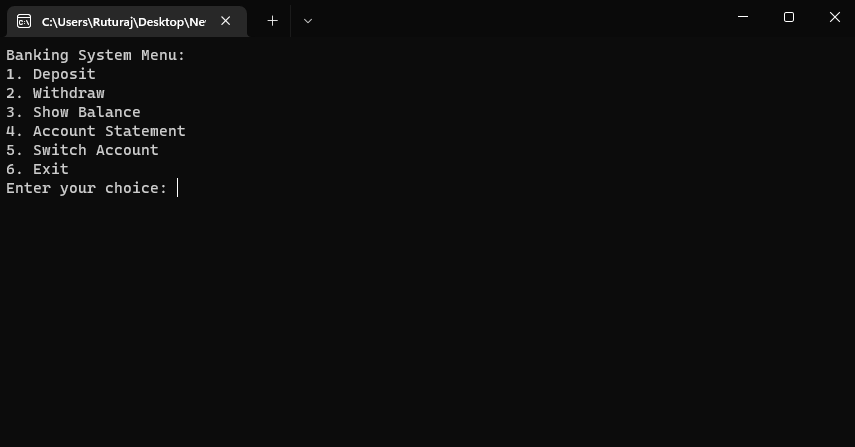
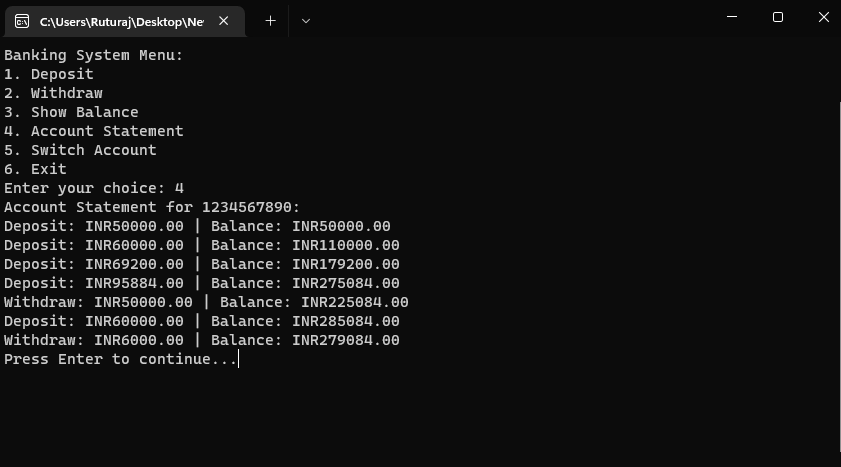

```markdown
# Banking System

This is a simple banking system implemented in C++ that supports functionalities such as account statements (read and write in a local JSON file), deposit/withdrawal, and showing the balance. The system ensures transactions are stored and retrieved in a persistent manner.

## Features

- Deposit money into an account
- Withdraw money from an account
- Show the current balance
- Display account statement
- Switch between different accounts

## Prerequisites

- C++ compiler (e.g., g++)
- [nlohmann/json](https://github.com/nlohmann/json) library for JSON handling

## Installation

### Step 1: Clone the repository

```sh
git clone https://github.com/ruturajbiswal/banking-system.git
cd banking-system
```

### Step 2: Download the JSON library

Download the `json.hpp` file from the [nlohmann/json GitHub repository](https://github.com/nlohmann/json/releases) and place it in the project directory.

### Step 3: Compile the code

Ensure you have a C++ compiler installed. You can use `g++` for this purpose.

```sh
g++ -o Main.exe Main.cpp
```

### Step 4: Run the executable

```sh
./Main.exe
```

## Usage

Upon running the program, you will be prompted to enter an account number. If the account does not exist, it will be created. You can then perform various operations as described below:

### Menu Options

1. **Deposit**: Add money to the account.
2. **Withdraw**: Withdraw money from the account.
3. **Show Balance**: Display the current balance of the account.
4. **Account Statement**: Show all transactions for the account.
5. **Switch Account**: Change to a different account.
6. **Exit**: Exit the program.

### Example

1. **Starting the program**:
    ```
    Enter account number: 1234567890
    ```

2. **Menu**:
    ```
    Banking System Menu:
    1. Deposit
    2. Withdraw
    3. Show Balance
    4. Account Statement
    5. Switch Account
    6. Exit
    Enter your choice: 1
    ```

3. **Deposit**:
    ```
    Enter amount to deposit: 5000
    Deposit: INR 5000.00 | Balance: INR 5000.00
    Press Enter to continue...
    ```

4. **Show Balance**:
    ```
    Current Balance: INR 5000.00
    Press Enter to continue...
    ```

## Screenshots

### Menu Tab



### Account Statement Tab




## Directory Structure

```
banking-system/
├── Accounts/            # Directory to store account JSON files
├── Image/               # Directory to store screenshot Image
├── Main.cpp    # Main source code file
├── json.hpp             # JSON library header file
├── README.md            # This README file
```
